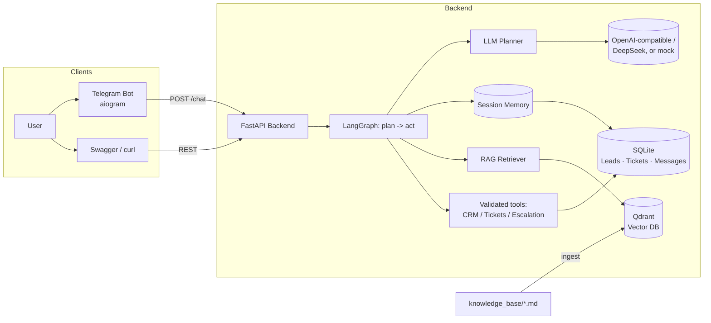
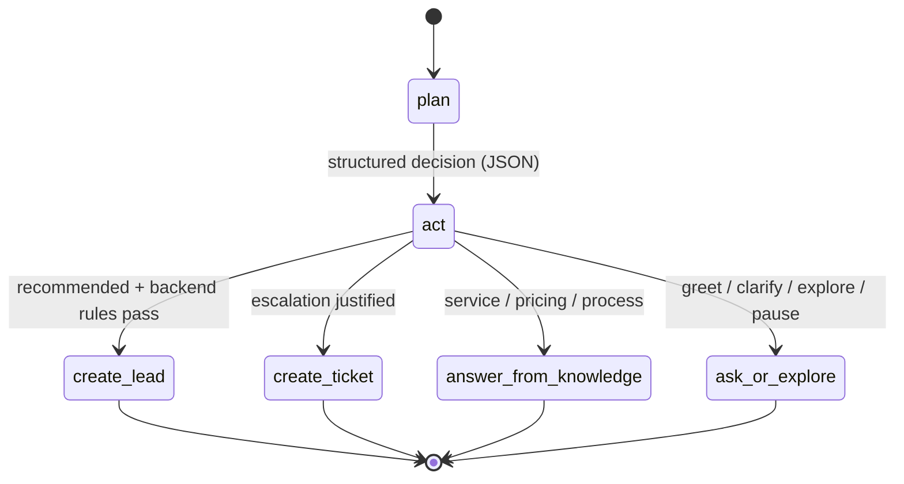

# AI Customer Assistant

A **configurable AI customer assistant** for small companies — built with
**LangGraph**, **RAG (Qdrant)**, **FastAPI**, a **Telegram bot**, a **mock CRM**,
support tickets and human escalation. Configure your business profile, upload your
own knowledge base, connect an LLM provider, and run the assistant locally or
behind your own API.

> **Ships with a fictional sample configuration** (a digital marketing studio,
> `.example` domains only) so it runs end to end out of the box. Replace the
> sample company profile and knowledge base with your own — see
> [docs/company-configuration.md](docs/company-configuration.md).

[](https://www.python.org/)
[](https://fastapi.tiangolo.com/)
[](https://langchain-ai.github.io/langgraph/)
[](LICENSE)

🇺🇸English | [🇷🇺Русский](./README.ru.md)

---

## Demo screenshots

<table>
  <tr>
    <td width="50%"></td>
    <td width="50%"></td>
  </tr>
  <tr>
    <td align="center"><em>Landing page</em></td>
    <td align="center"><em>Lead creation flow</em></td>
  </tr>
  <tr>
    <td width="50%"></td>
    <td width="50%"></td>
  </tr>
  <tr>
    <td align="center"><em>API overview</em></td>
    <td align="center"><em>Metrics dashboard</em></td>
  </tr>
</table>

Run the API with `uvicorn app.main:app --reload`, then open the local web demo in
a browser:

- Landing page: <http://localhost:8000/>
- Web demo: <http://localhost:8000/demo>
- API overview: <http://localhost:8000/api-overview>
- Metrics dashboard: <http://localhost:8000/metrics>
- Swagger docs: <http://localhost:8000/docs>

The web demo's replies all come from the live agent (no scripted flows). See
[docs/web-demo.md](docs/web-demo.md) for details, or
[docs/demo/demo-walkthrough.md](docs/demo/demo-walkthrough.md) for the full flow.
You can also talk to the agent through the Telegram bot.

## What it does

- LangGraph-based agent flow
- RAG over your own company knowledge base
- Qdrant vector search
- FastAPI backend
- Telegram bot integration
- CRM-style lead creation and escalation tickets
- Session memory and stateful dialogue
- Multi-turn lead qualification (asks only for missing fields, handles corrections)
- Natural dialogue policy: handles greetings, jokes, confusion and frustration,
  never repeats the same question twice, and switches to an exploration mode
  (general guidance, no lead details) — qualification stays optional

It runs end to end with no API keys (mock LLM and embeddings), or against a real
OpenAI-compatible endpoint (OpenAI, DeepSeek, etc.) when configured.

---

## Who it's for

Small companies field a flood of repetitive inbound messages: *"What do you do?"*,
*"How much is it?"*, *"How does this work?"*, plus genuine leads and the occasional
request that needs a human. Configure the assistant with your business profile and
documents and it can:

1. Answer questions about your **services** (from your knowledge base / RAG).
2. Explain **pricing**.
3. **Qualify** incoming leads and collect the missing details across turns.
4. Create a structured **lead** in a CRM-style store.
5. Create **support / escalation tickets**.
6. Answer questions grounded in your own documents.
7. **Route** complex cases to a human.
8. Keep **conversation context** across messages.

The shipped sample profile and knowledge base are fictional and use `.example`
domains; replace them with your own — see
[Configure your company](#configure-your-company).

## Key features

- **FastAPI** backend with Pydantic schemas and Swagger docs.
- **LLM dialogue planner** as the reasoning layer: for each message the model gets
  the company profile, relevant knowledge, history, memory, lead draft, ticket
  state and available actions, and returns one structured JSON decision (intent,
  mode, extracted fields, recommended action, reply, sources, confidence). The
  output is **Pydantic-validated**, with a one-shot JSON repair on malformed output.
- **Backend action validation**: the planner only *recommends* — the backend
  decides whether a lead or ticket is actually created, and the assistant only
  confirms an action after the backend executes it. The `/chat` response is
  transparent about it (`recommended_action`, `validation`, `action_executed`).
  Runs on a small **LangGraph** `plan → act` pipeline.
- **LangChain** for prompt templates, LLM abstraction and the retriever chain.
- **OpenAI-compatible / DeepSeek** support, plus an explicit deterministic `MOCK_LLM` mode for offline tests/demos.
- **RAG** over markdown docs with chunking + embeddings + vector search in **Qdrant**.
- **Mock CRM** + **support tickets** persisted in SQLite via a clean repository layer.
- **Session memory** – the agent remembers details (name, contact, service) within a session.
- **Telegram bot** (aiogram) that talks to the API.
- **Workspace metrics** endpoint (conversations, leads, tickets, escalation / resolved-by-AI rates).
- **Docker Compose** (app + Qdrant, optional bot), **pytest** suite, and thorough docs.
- **Runs with zero API keys** only when you explicitly enable `MOCK_LLM` + mock embeddings for offline demos.

## Tech stack

| Area | Choice |
|------|--------|
| Language | Python 3.10+ |
| API | FastAPI, Uvicorn, Pydantic v2 |
| Agent | LangGraph (stateful graph), LangChain |
| RAG | LangChain text splitters, Qdrant vector DB, OpenAI-compatible or mock embeddings |
| Storage | SQLite + SQLAlchemy 2.0 (repository layer) |
| Bot | aiogram 3 |
| Tooling | Docker Compose, pytest, ruff/mypy configs |

## Architecture



## Planner flow



In the `plan` node the planner receives the full context and returns a single
JSON decision; the `act` node validates and executes it. The LLM never creates a
lead or ticket directly — the backend rules do.

## Setup (local, no Docker)

Requires Python 3.10+.

```bash
# 1. Clone & enter
git clone <your-fork-url> ai-marketing-agent-rag-langgraph
cd ai-marketing-agent-rag-langgraph

# 2. Create a virtualenv and install
python -m venv .venv && source .venv/bin/activate   # Windows: .venv\Scripts\activate
pip install -r requirements.txt

# 3. Configure a real OpenAI-compatible LLM
cp .env.example .env          # defaults: MOCK_LLM=false
# then set OPENAI_API_KEY / OPENAI_BASE_URL / LLM_MODEL

# 4. Ingest the knowledge base (uses in-memory store if Qdrant isn't running)
python scripts/ingest_knowledge.py

# 5. (optional) Seed synthetic demo leads/tickets
python scripts/seed_demo_data.py

# 6. Run the API
uvicorn app.main:app --reload
```

Open the interactive docs at **http://localhost:8000/docs**.

## Configure your company

The assistant is configurable — it has no company baked in. The business profile is
resolved from, in increasing priority:

1. built-in safe fallbacks,
2. `config/company.example.json` (the shipped fictional sample),
3. `config/company.local.json` (your real deployment — **git-ignored**),
4. environment variables.

To configure your own company, either set environment variables in `.env`:

```env
COMPANY_NAME="Acme Growth Studio"
COMPANY_DOMAIN="acme.example"
COMPANY_DESCRIPTION="Digital marketing and customer acquisition agency"
COMPANY_CONTACT_EMAIL="hello@acme.example"
DEFAULT_ASSISTANT_NAME="AI Assistant"
DEFAULT_ESCALATION_TARGET="human manager"
BUSINESS_INDUSTRY="digital marketing"
```

…or copy the JSON template and edit it:

```bash
cp config/company.local.json.example config/company.local.json
```

Then replace the sample documents in `knowledge_base/` with your own and re-ingest:

```bash
python scripts/ingest_knowledge.py
```

Full instructions: [docs/company-configuration.md](docs/company-configuration.md).
**Never commit `.env`, API keys, or `config/company.local.json`.**

### Using a real LLM

Set the following in `.env` to use an OpenAI-compatible endpoint:

```env
MOCK_LLM=false
USE_MOCK_EMBEDDINGS=false
OPENAI_API_KEY=sk-...
OPENAI_BASE_URL=https://api.openai.com/v1
LLM_MODEL=gpt-4o-mini
EMBEDDING_MODEL=text-embedding-3-small
```

## Docker setup

```bash
# App + Qdrant (demo mode, no keys needed). Ingestion runs automatically.
docker compose up --build

# Also start the Telegram bot (needs TELEGRAM_BOT_TOKEN in your shell/.env)
docker compose --profile bot up --build
```

- API: http://localhost:8000/docs
- Qdrant dashboard: http://localhost:6333/dashboard

## Telegram bot setup

1. Create a bot with [@BotFather](https://t.me/BotFather) and copy the token.
2. Put it in `.env`:
   ```env
   TELEGRAM_BOT_TOKEN=123456:ABC-your-token
   API_BASE_URL=http://localhost:8000
   ```
3. Start the API, then run the bot:
   ```bash
   python -m bot.main
   ```
4. Message your bot: `/start`, `/help`, or just ask a question.

The bot derives a stable `session_id` from the Telegram user id, so memory works
per user. **Keep your token in `.env` only – never commit it.**

## API examples

```bash
# Health
curl http://localhost:8000/health

# Chat: ask about services
curl -X POST http://localhost:8000/chat -H "Content-Type: application/json" \
  -d '{"session_id":"demo-1","user_message":"What services do you offer?"}'

# Chat: become a lead (two turns, same session_id -> memory)
curl -X POST http://localhost:8000/chat -H "Content-Type: application/json" \
  -d '{"session_id":"demo-2","user_message":"I want to run Google Ads for my store."}'
curl -X POST http://localhost:8000/chat -H "Content-Type: application/json" \
  -d '{"session_id":"demo-2","user_message":"My name is Sam Carter, email sam@store.example."}'

# Create a lead directly
curl -X POST http://localhost:8000/crm/leads -H "Content-Type: application/json" \
  -d '{"name":"Jamie Lee","contact":"jamie@acme.example","service_interest":"SEO"}'

# Tickets & metrics
curl http://localhost:8000/tickets
curl http://localhost:8000/metrics/demo
```

| Method | Path | Purpose |
|--------|------|---------|
| GET | `/health` | Liveness probe |
| POST | `/chat` | Talk to the agent |
| POST | `/crm/leads` | Create a CRM lead |
| GET | `/crm/leads` | List leads |
| POST | `/tickets` | Create a ticket |
| GET | `/tickets` | List tickets |
| GET | `/tickets/{id}` | Get one ticket |
| POST | `/knowledge/ingest` | (Re)index the knowledge base |
| GET | `/metrics/demo` | Workspace metrics |

## Example conversations

See [docs/demo/demo-walkthrough.md](docs/demo/demo-walkthrough.md) for ready-to-run
conversations (services, pricing, becoming a lead, escalation, and memory). To drive
the full lead flow against a running server, use
`python scripts/test_production_flow.py`.

## Screenshots

Add screenshots to `docs/screenshots/` – see
[docs/screenshots/README.md](docs/screenshots/README.md) for placeholders and a
social-preview image prompt.

## Limitations

See [docs/limitations.md](docs/limitations.md) – highlights: the mock LLM and mock
embeddings are deterministic stand-ins (not semantically strong), there is no auth,
and the "CRM" is a local SQLite table modelling the integration pattern rather than
a real SaaS connector.

## Roadmap

See [docs/roadmap.md](docs/roadmap.md): real CRM connector, streaming responses,
auth, evaluation harness, richer analytics dashboard, and more.

## Documentation

- [Company configuration](docs/company-configuration.md) / [RU](docs/company-configuration.ru.md)
- [Architecture](docs/architecture.md) / [RU](docs/architecture.ru.md)
- [API](docs/api.md) / [RU](docs/api.ru.md)
- [RAG](docs/rag.md) / [RU](docs/rag.ru.md)
- [LangGraph flow](docs/langgraph-flow.md) / [RU](docs/langgraph-flow.ru.md)
- [Web demo](docs/web-demo.md) / [RU](docs/web-demo.ru.md)
- [Demo walkthrough](docs/demo/demo-walkthrough.md) / [RU](docs/demo/demo-walkthrough.ru.md)
- [Portfolio case study](docs/portfolio-case-study.md) / [RU](docs/portfolio-case-study.ru.md)
- [Limitations](docs/limitations.md) / [RU](docs/limitations.ru.md)
- [Roadmap](docs/roadmap.md) / [RU](docs/roadmap.ru.md)
- [Screenshots](docs/screenshots/README.md) / [RU](docs/screenshots/README.ru.md)

## License

MIT – see [LICENSE](LICENSE). All data is fictional/synthetic.
