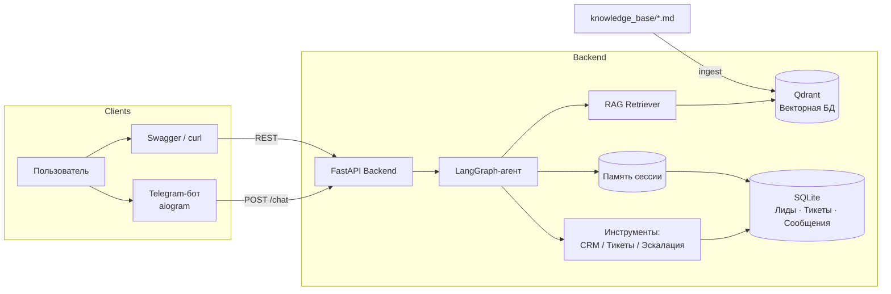
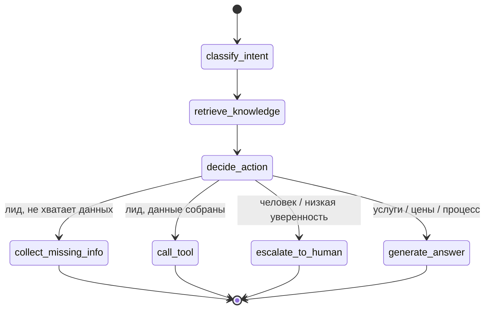

# NovaGrowth AI Marketing Agent 🤖📈

Разговорный ИИ-агент для **вымышленного** агентства цифрового маркетинга – на
**LangGraph**, **RAG (Qdrant)**, **FastAPI**, с **Telegram-ботом**, **мок-CRM**,
тикетами поддержки и эскалацией на человека.

> **Портфолио-кейс для вымышленного digital-агентства. Все данные в демо являются тестовыми.**
> NovaGrowth Agency – не реальная компания, проект не связан ни с каким реальным бизнесом.

🇬🇧 English version: [README.md](README.md)

---

## Обзор демо

soon...

Запустите API командой `uvicorn app.main:app --reload` и откройте локальное
веб-демо в браузере:

- Лендинг: <http://localhost:8000/>
- Веб-демо: <http://localhost:8000/demo>
- Обзор API: <http://localhost:8000/api-overview>
- Дашборд метрик: <http://localhost:8000/metrics>
- Swagger-документация: <http://localhost:8000/docs>

Подробнее – в [docs/web-demo.md](docs/web-demo.md), полный сценарий –
в [docs/demo/demo-walkthrough.md](docs/demo/demo-walkthrough.md). С агентом также
можно общаться через Telegram-бот.

## Что показывает проект

- Поток агента на LangGraph
- RAG по базе знаний маркетингового агентства
- Векторный поиск в Qdrant
- Бэкенд на FastAPI
- Интеграцию с Telegram-ботом
- CRM-действия и тикеты эскалации
- Память сессии и состояниевый диалог

Проект работает целиком без API-ключей (мок-LLM и эмбеддинги) либо с реальным
OpenAI-совместимым эндпоинтом при настройке.

---

## Зачем этот проект

Маркетинговые агентства получают множество повторяющихся входящих сообщений:
*«Что вы делаете?»*, *«Сколько стоит?»*, *«Как устроена кампания?»*, а также
реальных лидов и иногда жалобы, требующие участия человека. Этот проект –
**прототип для портфолио**, *реалистичный демо-сценарий*, **вдохновлённый типичными
рабочими процессами маркетинговых агентств**, который показывает, как небольшой
ИИ-агент может:

1. Отвечать на вопросы об **услугах** агентства (из базы знаний / RAG).
2. Объяснять **тарифные пакеты**.
3. **Квалифицировать** входящих лидов и собирать недостающие данные.
4. Создавать **лид** в мок-CRM.
5. Создавать **тикеты поддержки / эскалации**.
6. Отвечать на **внутренние** вопросы из базы знаний.
7. **Передавать** сложные случаи менеджеру-человеку.
8. Хранить **контекст разговора** между сообщениями.

Это намеренно **MVP**: чистый, читаемый код, ориентированный на демонстрацию
навыков, за которые нанимают Python AI Engineer уровня Junior/Middle.

## Ключевые возможности

- Бэкенд на **FastAPI** со схемами Pydantic и документацией Swagger.
- Состояниевый агент на **LangGraph**: `classify_intent > retrieve_knowledge >
  decide_action > {collect_missing_info | call_tool | generate_answer |
  escalate_to_human}`.
- **LangChain** для шаблонов промптов, абстракции LLM и retriever-цепочки.
- **RAG** по markdown-документамcle: чанкинг + эмбеддинги + векторный поиск в **Qdrant**.
- **Мок-CRM** + **тикеты**, сохраняемые в SQLite через чистый слой репозиториев.
- **Память сессии** – агент помнит данные (имя, контакт, услугу) в рамках сессии.
- **Telegram-бот** (aiogram), работающий через API.
- Эндпоинт **демо-метрик** (разговоры, лиды, тикеты, доли эскалации / решённых ИИ).
- **Docker Compose** (app + Qdrant, опц. бот), набор тестов **pytest**, документация.
- **Работает без единого API-ключа** в режиме `MOCK_LLM` + мок-эмбеддинги.

## Технологический стек

| Область | Выбор |
|---------|-------|
| Язык | Python 3.10+ |
| API | FastAPI, Uvicorn, Pydantic v2 |
| Агент | LangGraph (граф состояний), LangChain |
| RAG | LangChain text splitters, Qdrant, OpenAI-совместимые или мок-эмбеддинги |
| Хранилище | SQLite + SQLAlchemy 2.0 (слой репозиториев) |
| Бот | aiogram 3 |
| Инфраструктура | Docker Compose, pytest, конфиги ruff/mypy |

## Архитектура



## Поток LangGraph



## Установка (локально, без Docker)

Нужен Python 3.10+.

```bash
git clone <url-вашего-форка> ai-marketing-agent-rag-langgraph
cd ai-marketing-agent-rag-langgraph

python -m venv .venv && source .venv/bin/activate   # Windows: .venv\Scripts\activate
pip install -r requirements.txt

cp .env.example .env          # по умолчанию: MOCK_LLM=true, мок-эмбеддинги

python scripts/ingest_knowledge.py   # индексация базы знаний
python scripts/seed_demo_data.py     # (опц.) демо-данные

uvicorn app.main:app --reload
```

Документация: **http://localhost:8000/docs**.

### Использование реального LLM

В `.env`:

```env
MOCK_LLM=false
USE_MOCK_EMBEDDINGS=false
OPENAI_API_KEY=sk-...
OPENAI_BASE_URL=https://api.openai.com/v1
LLM_MODEL=gpt-4o-mini
EMBEDDING_MODEL=text-embedding-3-small
```

## Запуск в Docker

```bash
# App + Qdrant (демо-режим, ключи не нужны). Индексация запускается автоматически.
docker compose up --build

# Дополнительно запустить Telegram-бот (нужен TELEGRAM_BOT_TOKEN)
docker compose --profile bot up --build
```

- API: http://localhost:8000/docs
- Дашборд Qdrant: http://localhost:6333/dashboard

## Настройка Telegram-бота

1. Создайте бота через [@BotFather](https://t.me/BotFather) и скопируйте токен.
2. Добавьте его в `.env`:
   ```env
   TELEGRAM_BOT_TOKEN=123456:ABC-ваш-токен
   API_BASE_URL=http://localhost:8000
   ```
3. Запустите API, затем бота:
   ```bash
   python -m bot.main
   ```
4. Напишите боту: `/start`, `/help` или любой вопрос.

Бот формирует стабильный `session_id` из id пользователя Telegram, поэтому память
работает по каждому пользователю. **Храните токен только в `.env` – не коммитьте его.**

## Примеры API

```bash
# Проверка здоровья
curl http://localhost:8000/health

# Чат: вопрос об услугах
curl -X POST http://localhost:8000/chat -H "Content-Type: application/json" \
  -d '{"session_id":"demo-1","user_message":"Какие услуги вы предлагаете?"}'

# Чат: стать лидом (два хода, один session_id -> память)
curl -X POST http://localhost:8000/chat -H "Content-Type: application/json" \
  -d '{"session_id":"demo-2","user_message":"I want to run Google Ads for my store."}'
curl -X POST http://localhost:8000/chat -H "Content-Type: application/json" \
  -d '{"session_id":"demo-2","user_message":"My name is Sam Carter, email sam@store.example."}'

# Создать лид напрямую
curl -X POST http://localhost:8000/crm/leads -H "Content-Type: application/json" \
  -d '{"name":"Jamie Lee","contact":"jamie@acme.example","service_interest":"SEO"}'

curl http://localhost:8000/tickets
curl http://localhost:8000/metrics/demo
```

| Метод | Путь | Назначение |
|-------|------|-----------|
| GET | `/health` | Проверка живости |
| POST | `/chat` | Диалог с агентом |
| POST | `/crm/leads` | Создать лид |
| GET | `/crm/leads` | Список лидов |
| POST | `/tickets` | Создать тикет |
| GET | `/tickets` | Список тикетов |
| GET | `/tickets/{id}` | Получить тикет |
| POST | `/knowledge/ingest` | Переиндексировать базу знаний |
| GET | `/metrics/demo` | Демо-метрики |

## Демо-сценарии

См. [docs/demo-scenarios.md](docs/demo-scenarios.md) – пять готовых диалогов
(услуги, цены, превращение в лида, эскалация, память).

## Скриншоты

Добавляйте скриншоты в `docs/screenshots/` – см.
[docs/screenshots/README.md](docs/screenshots/README.md) (плейсхолдеры и промпт
для превью-изображения).

## Ограничения

Это MVP для портфолио. См. [docs/limitations.md](docs/limitations.md): мок-LLM и
мок-эмбеддинги – детерминированные заглушки (не семантически сильные), нет
аутентификации, «CRM» – это локальная таблица SQLite, моделирующая паттерн
интеграции, а не реальный SaaS.

## Дорожная карта

См. [docs/roadmap.md](docs/roadmap.md): коннектор к реальной CRM, потоковые ответы,
аутентификация, харнесс для оценки качества, расширенная аналитика и др.

## Документация

- [docs/architecture.md](docs/architecture.md)
- [docs/langgraph-flow.md](docs/langgraph-flow.md)
- [docs/rag.md](docs/rag.md)
- [docs/api.md](docs/api.md)
- [docs/demo-scenarios.md](docs/demo-scenarios.md)
- [docs/portfolio-case-study.md](docs/portfolio-case-study.md)
- [docs/limitations.md](docs/limitations.md)
- [docs/roadmap.md](docs/roadmap.md)

## Лицензия

MIT – см. [LICENSE](LICENSE). Все данные вымышленные/синтетические.
