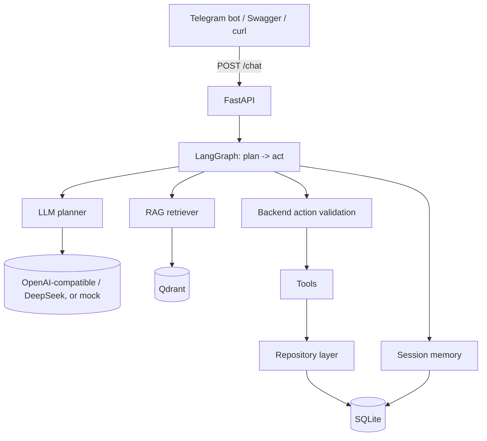

# Architecture

🇺🇸English | [🇷🇺Русский](./architecture.ru.md)

> Configurable AI customer assistant platform. Ships with a fictional sample
> company profile and knowledge base (`.example` domains); replace them with your own.

## Overview

The system is a small, well-layered FastAPI service that exposes a conversational
agent. The reasoning layer is an **LLM dialogue planner**: for each message it
receives the company profile, relevant knowledge (RAG), recent history, session
memory, the lead draft, the ticket state and the list of available actions, and
returns a single structured JSON decision. The **backend then validates and
executes** the recommended action — the LLM never creates a lead or ticket on its
own. Knowledge questions are grounded with **RAG** over a Qdrant vector store;
actions go through a thin **tools** layer onto a SQLite-backed **repository** layer.

### The planner (`app/agent/planner.py`)

The planner is the single decision point. Its JSON contract includes the user
intent, the assistant mode (`answering / exploring / qualifying / paused /
escalating / casual`), extracted fields, memory updates, the missing fields, a
recommended action, the natural reply, whether knowledge was used and its sources,
and a confidence score. Output is parsed robustly and **validated with Pydantic**
(enums where they help); invalid JSON is **repaired with one retry**, and a
still-invalid result becomes a controlled internal error — a malformed reply never
crashes a turn. With `MOCK_LLM=true` a deterministic engine produces the same
contract offline, and it is also the safe fallback if a real model call fails.

### Backend action validation (`app/agent/validation.py`)

The planner only *recommends*. `create_lead` runs only when name, company, a valid
email, a service interest and a budget (or an explicit "budget unknown" the user
agreed to) are all present, the user is actually qualifying, and no lead exists
yet — otherwise the assistant asks for what's missing. `create_ticket` runs only
for a genuine human request, complaint, custom/enterprise need, or a
high-confidence escalation the rules agree with — otherwise it clarifies instead.

## Layers

| Layer | Module(s) | Responsibility |
|-------|-----------|----------------|
| API | `app/api/*`, `app/main.py` | HTTP endpoints, Pydantic validation, Swagger |
| Agent | `app/agent/*` | LangGraph orchestrator, LLM planner, understanding, memory, LLM abstraction |
| RAG | `app/rag/*` | loading, chunking, embeddings, vector store, retriever |
| Tools | `app/tools/*` | CRM / ticket / escalation actions (integration pattern) |
| Data | `app/db/*` | SQLAlchemy models + repositories |
| Schemas | `app/schemas/*` | Pydantic request/response models |
| Bot | `bot/*` | aiogram Telegram client |

## Design choices

- **Repository layer** keeps persistence out of the API and agent code, so each
  piece is small and testable.
- **Tools** model how a real CRM integration would be structured (a single function
  the agent calls) without depending on any external SaaS.
- **Vector store fallback**: if Qdrant is unreachable, an in-memory cosine index is
  used so the project runs anywhere (CI, laptops, tests).
- **Mock modes** (`MOCK_LLM`, `USE_MOCK_EMBEDDINGS`) make the whole system runnable
  with zero API keys, which is ideal for a public portfolio repo.

## Request lifecycle (`POST /chat`)

1. FastAPI validates the body into `ChatRequest`.
2. `run_agent()` loads session history from memory and builds the initial `AgentState`.
3. The LangGraph graph runs `plan` → `act`: the `plan` node retrieves knowledge
   and asks the planner for a decision; the `act` node validates and executes the
   recommended action (or asks a follow-up / answers from knowledge).
4. The answer + side-effects (lead/ticket ids) + session memory are persisted.
5. FastAPI serialises the result into `ChatResponse`, including transparent
   metadata: `recommended_action` (what the planner proposed), `validation`
   (the backend verdict + reason), `action_executed` (whether a lead/ticket was
   actually created), `planner_decision`, `user_intent`, `knowledge_used` and
   sources. Internal prompts are never exposed.

Configure a real model with `MOCK_LLM=false`, `OPENAI_BASE_URL`,
`OPENAI_API_KEY` and `LLM_MODEL` (e.g. DeepSeek: `OPENAI_BASE_URL=https://api.deepseek.com`,
`LLM_MODEL=deepseek-chat`). Keys live only in the environment and are never logged.
