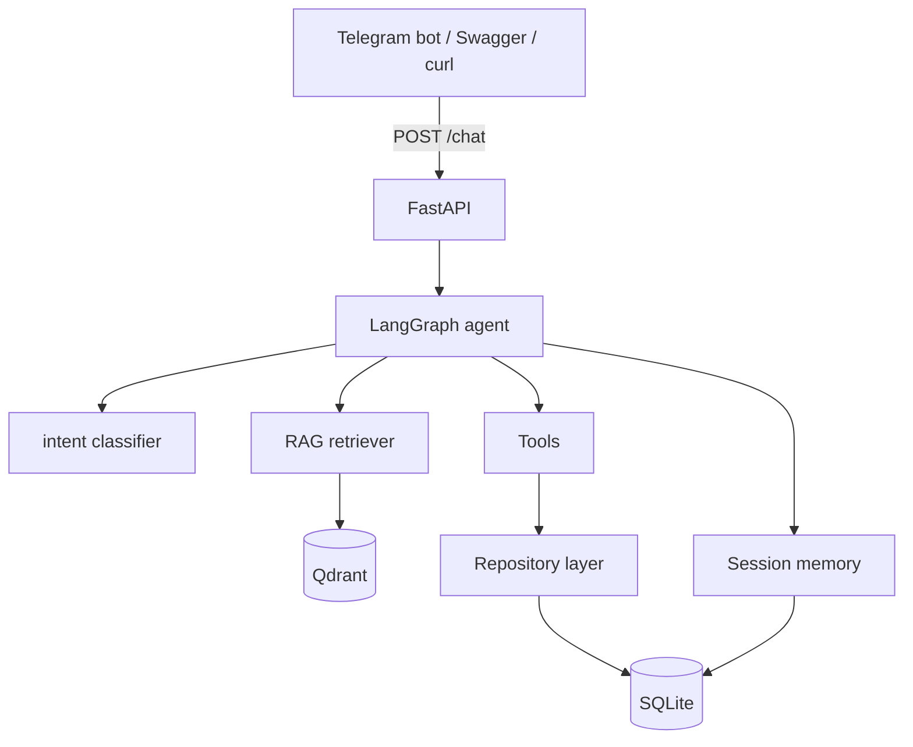

# Architecture

🇺🇸English | [🇷🇺Русский](./architecture.ru.md)

> Configurable AI customer assistant platform. Ships with a fictional sample
> company profile and knowledge base (`.example` domains); replace them with your own.

## Overview

The system is a small, well-layered FastAPI service that exposes a conversational
agent. The agent is a **LangGraph** state machine; knowledge questions are answered
with **RAG** over a Qdrant vector store; actions (creating leads, tickets, escalating)
go through a thin **tools** layer onto a SQLite-backed **repository** layer.

## Layers

| Layer | Module(s) | Responsibility |
|-------|-----------|----------------|
| API | `app/api/*`, `app/main.py` | HTTP endpoints, Pydantic validation, Swagger |
| Agent | `app/agent/*` | LangGraph graph, intent, prompts, memory, LLM abstraction |
| RAG | `app/rag/*` | loading, chunking, embeddings, vector store, retriever |
| Tools | `app/tools/*` | CRM / ticket / escalation actions (integration pattern) |
| Data | `app/db/*` | SQLAlchemy models + repositories |
| Schemas | `app/schemas/*` | Pydantic request/response models |
| Bot | `bot/*` | aiogram Telegram client |

## Design choices

- **Repository layer** keeps persistence out of the API and agent code, so each
  piece is small and testable.
- **Tools** model how a real CRM integration would be structured (a single function
  the agent calls) without depending on any external SaaS.
- **Vector store fallback**: if Qdrant is unreachable, an in-memory cosine index is
  used so the project runs anywhere (CI, laptops, tests).
- **Mock modes** (`MOCK_LLM`, `USE_MOCK_EMBEDDINGS`) make the whole system runnable
  with zero API keys, which is ideal for a public portfolio repo.

## Request lifecycle (`POST /chat`)

1. FastAPI validates the body into `ChatRequest`.
2. `run_agent()` loads session history from memory and builds the initial `AgentState`.
3. The LangGraph graph runs: classify > retrieve > decide > action.
4. The resulting answer + side-effects (lead/ticket ids) are persisted to memory.
5. FastAPI serialises the result into `ChatResponse`.
