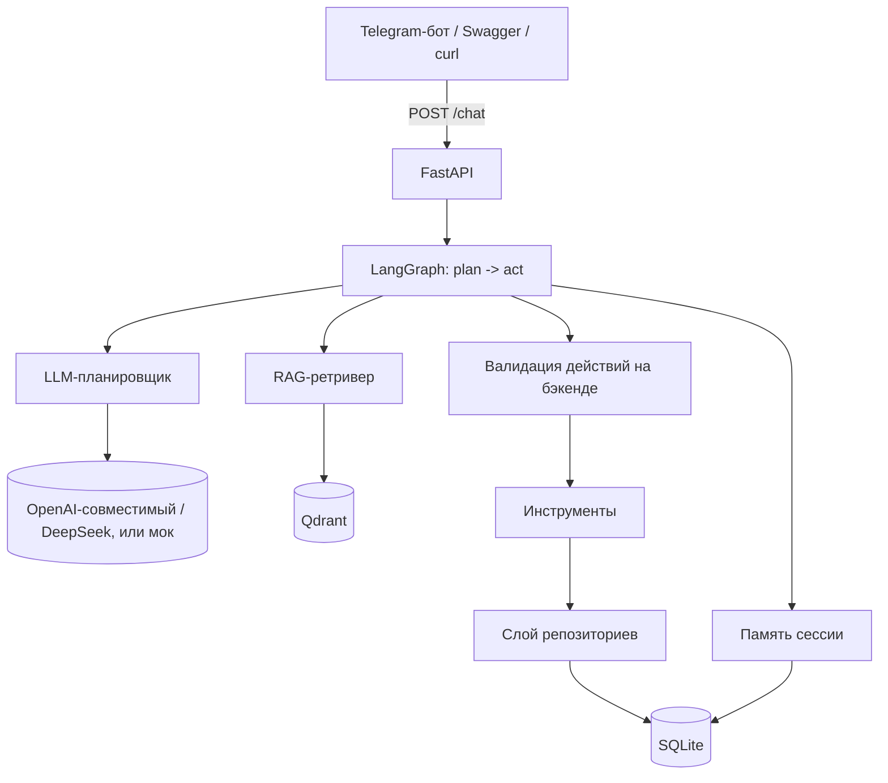

# Архитектура

[🇺🇸English](./architecture.md) | 🇷🇺Русский

> Настраиваемая платформа ИИ-ассистента для клиентов. В комплекте — вымышленный
> образцовый профиль компании и база знаний (домены `.example`); замените их своими.

## Обзор

Система — это небольшой, аккуратно разделённый на слои сервис на FastAPI, который
предоставляет разговорного агента. Слой рассуждений — это **LLM-планировщик
диалога**: на каждое сообщение он получает профиль компании, релевантные знания
(RAG), недавнюю историю, память сессии, черновик лида, состояние тикета и список
доступных действий и возвращает одно структурированное JSON-решение. **Бэкенд
затем валидирует и выполняет** рекомендованное действие — LLM никогда не создаёт
лид или тикет самостоятельно. Вопросы по базе знаний обрабатываются через **RAG**
поверх Qdrant; действия проходят через тонкий слой **инструментов** и слой
**репозиториев** поверх SQLite.

### Планировщик (`app/agent/planner.py`)

Планировщик — единственная точка принятия решения. Его JSON-контракт включает
интент пользователя, режим ассистента (`answering / exploring / qualifying /
paused / escalating / casual`), извлечённые поля, обновления памяти, недостающие
поля, рекомендованное действие, естественный ответ, признак использования знаний
и источники, а также уверенность. Ответ парсится устойчиво и **валидируется через
Pydantic** (с enum, где это полезно); невалидный JSON **чинится одной повторной
попыткой**, а по-прежнему некорректный результат становится контролируемой
внутренней ошибкой — некорректный ответ не роняет ход диалога. При `MOCK_LLM=true`
тот же контракт формирует детерминированный движок офлайн — он же является
безопасным запасным вариантом при сбое реальной модели.

### Валидация действий на бэкенде (`app/agent/validation.py`)

Планировщик только *рекомендует*. `create_lead` срабатывает лишь когда есть имя,
компания, корректный e-mail, интересующая услуга и бюджет (или явное «бюджет
неизвестен», с которым пользователь согласился), пользователь действительно
оформляет заявку и лид ещё не создан — иначе ассистент спрашивает недостающее.
`create_ticket` срабатывает только при реальном запросе человека, жалобе,
кастомной/enterprise-задаче или эскалации с высокой уверенностью, с которой
согласны правила — иначе уточняет.

## Слои

| Слой | Модули | Ответственность |
|------|--------|-----------------|
| API | `app/api/*`, `app/main.py` | HTTP-эндпоинты, валидация Pydantic, Swagger |
| Агент | `app/agent/*` | оркестратор LangGraph, LLM-планировщик, понимание, память, абстракция LLM |
| RAG | `app/rag/*` | загрузка, чанкинг, эмбеддинги, векторное хранилище, ретривер |
| Инструменты | `app/tools/*` | действия CRM / тикеты / эскалация (паттерн интеграции) |
| Данные | `app/db/*` | модели и репозитории SQLAlchemy |
| Схемы | `app/schemas/*` | Pydantic-модели запросов/ответов |
| Бот | `bot/*` | Telegram-клиент на aiogram |

## Проектные решения

- **Слой репозиториев** выносит работу с хранилищем из кода API и агента, поэтому
  каждый компонент маленький и тестируемый.
- **Инструменты** моделируют, как была бы устроена реальная интеграция с CRM
  (одна функция, которую вызывает агент), без зависимости от внешнего SaaS.
- **Запасной вариант векторного хранилища**: если Qdrant недоступен, используется
  in-memory косинусный индекс, поэтому проект запускается где угодно (CI, ноутбук, тесты).
- **Мок-режимы** (`MOCK_LLM`, `USE_MOCK_EMBEDDINGS`) позволяют запустить всю систему
  без единого API-ключа — это удобно для публичного репозитория-портфолио.

## Жизненный цикл запроса (`POST /chat`)

1. FastAPI валидирует тело запроса в `ChatRequest`.
2. `run_agent()` загружает историю сессии из памяти и собирает начальный `AgentState`.
3. Граф LangGraph выполняет `plan` → `act`: узел `plan` достаёт знания и получает
   решение планировщика; узел `act` валидирует и выполняет рекомендованное
   действие (или задаёт уточняющий вопрос / отвечает по базе знаний).
4. Ответ, побочные эффекты (id лида/тикета) и память сессии сохраняются.
5. FastAPI сериализует результат в `ChatResponse`, включая прозрачные метаданные:
   `recommended_action` (что предложил планировщик), `validation` (вердикт бэкенда
   и причина), `action_executed` (был ли реально создан лид/тикет),
   `planner_decision`, `user_intent`, `knowledge_used` и источники. Внутренние
   промпты никогда не раскрываются.

Реальная модель настраивается через `MOCK_LLM=false`, `OPENAI_BASE_URL`,
`OPENAI_API_KEY` и `LLM_MODEL` (например, DeepSeek:
`OPENAI_BASE_URL=https://api.deepseek.com`, `LLM_MODEL=deepseek-chat`). Ключи
хранятся только в окружении и никогда не логируются.
