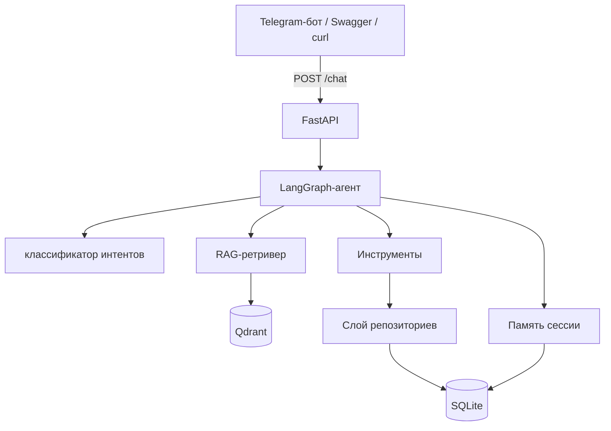

# Архитектура

[🇺🇸English](./architecture.md) | 🇷🇺Русский

> Настраиваемая платформа ИИ-ассистента для клиентов. В комплекте — вымышленный
> образцовый профиль компании и база знаний (домены `.example`); замените их своими.

## Обзор

Система — это небольшой, аккуратно разделённый на слои сервис на FastAPI, который
предоставляет разговорного агента. Агент построен как конечный автомат на
**LangGraph**; вопросы по базе знаний обрабатываются через **RAG** поверх
векторного хранилища Qdrant; действия (создание лидов, тикетов, эскалация)
проходят через тонкий слой **инструментов** и слой **репозиториев** поверх SQLite.

## Слои

| Слой | Модули | Ответственность |
|------|--------|-----------------|
| API | `app/api/*`, `app/main.py` | HTTP-эндпоинты, валидация Pydantic, Swagger |
| Агент | `app/agent/*` | граф LangGraph, интенты, промпты, память, абстракция LLM |
| RAG | `app/rag/*` | загрузка, чанкинг, эмбеддинги, векторное хранилище, ретривер |
| Инструменты | `app/tools/*` | действия CRM / тикеты / эскалация (паттерн интеграции) |
| Данные | `app/db/*` | модели и репозитории SQLAlchemy |
| Схемы | `app/schemas/*` | Pydantic-модели запросов/ответов |
| Бот | `bot/*` | Telegram-клиент на aiogram |

## Проектные решения

- **Слой репозиториев** выносит работу с хранилищем из кода API и агента, поэтому
  каждый компонент маленький и тестируемый.
- **Инструменты** моделируют, как была бы устроена реальная интеграция с CRM
  (одна функция, которую вызывает агент), без зависимости от внешнего SaaS.
- **Запасной вариант векторного хранилища**: если Qdrant недоступен, используется
  in-memory косинусный индекс, поэтому проект запускается где угодно (CI, ноутбук, тесты).
- **Мок-режимы** (`MOCK_LLM`, `USE_MOCK_EMBEDDINGS`) позволяют запустить всю систему
  без единого API-ключа — это удобно для публичного репозитория-портфолио.

## Жизненный цикл запроса (`POST /chat`)

1. FastAPI валидирует тело запроса в `ChatRequest`.
2. `run_agent()` загружает историю сессии из памяти и собирает начальный `AgentState`.
3. Граф LangGraph выполняется: классификация → поиск → решение → действие.
4. Полученный ответ и побочные эффекты (id лида/тикета) сохраняются в память.
5. FastAPI сериализует результат в `ChatResponse`.
