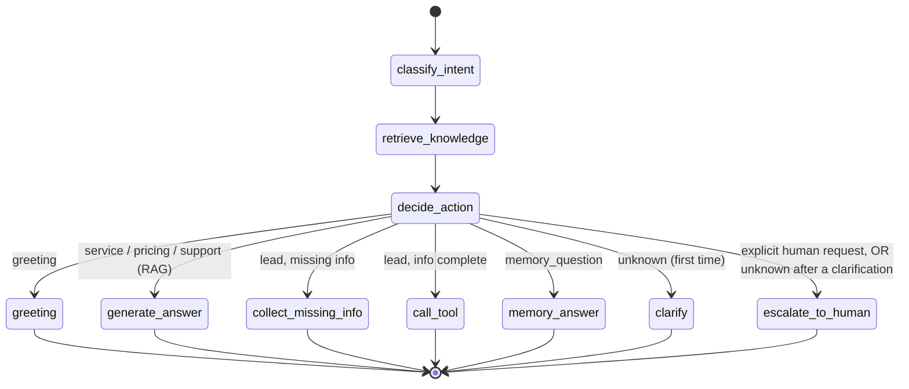

# LangGraph flow

English | [Русский](./langgraph-flow.ru.md)

The agent is a compiled `StateGraph` (see `app/agent/graph.py`). State is a
`TypedDict` (`app/agent/state.py`) threaded through every node.

## Nodes

| Node | What it does |
|------|--------------|
| `classify_intent` | Rule-based (mock) or LLM intent + confidence; extracts lead slots into memory |
| `retrieve_knowledge` | For knowledge intents, fetches top-k chunks from the vector store |
| `decide_action` | Sets the routing key based on intent and lead/clarification state |
| `greeting` | Replies with a short, friendly onboarding message (no ticket, no lead) |
| `generate_answer` | Builds a grounded answer from retrieved context (RAG) |
| `collect_missing_info` | Asks one short follow-up for missing lead fields |
| `call_tool` | Creates the CRM lead from collected slots, clears them |
| `memory_answer` | Answers a recall question from the collected session slots |
| `clarify` | Asks one clarifying question for an unclear message |
| `escalate_to_human` | Creates a high-priority ticket and tells the user |

## Supported intents

`greeting`, `service_question`, `pricing_question`, `lead_qualification`,
`create_lead`, `support_request`, `human_escalation`, `memory_question`,
`unknown`.

## Decision rules

- **Greeting** → a friendly onboarding reply. No ticket, no lead.
- **Service / pricing / support questions** → RAG answer (`generate_answer`).
- **Interested / wants to start (lead_qualification)** → collect `name` + `contact`
  (and ideally company, service, budget); once present, create the lead.
- **Full lead details given (create_lead)** → `call_tool` creates the CRM lead.
- **Recall question (memory_question)** → answer from the session's stored details.
- **Explicit human request, anger/complaint, or custom-enterprise need
  (human_escalation)** → create an escalation ticket.
- **Unclear message (unknown)** → ask one clarifying question. Only if the next
  message is *still* unclear does the agent escalate.

Crucially, low confidence by itself never creates a ticket: greetings and generic
"new customer" messages are treated as lead qualification, not escalation.
