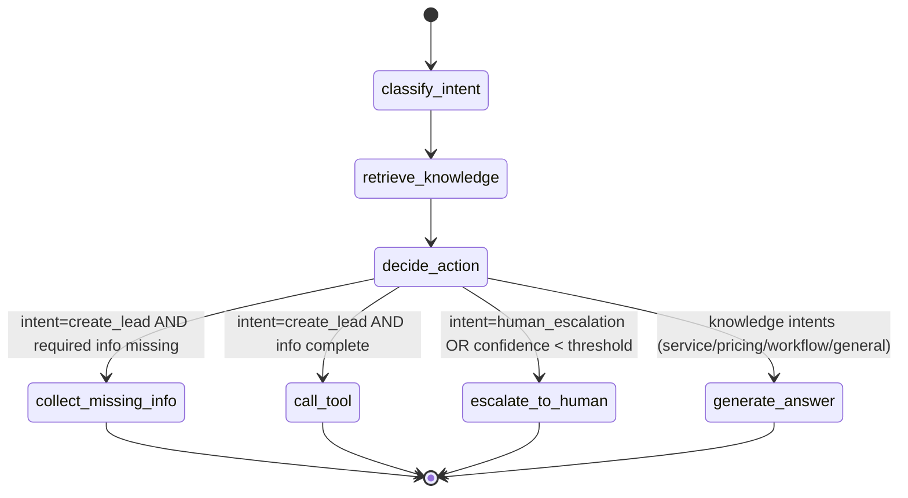

# LangGraph flow

The agent is a compiled `StateGraph` (see `app/agent/graph.py`). State is a
`TypedDict` (`app/agent/state.py`) threaded through every node.

## Nodes

| Node | What it does |
|------|--------------|
| `classify_intent` | Rule-based (mock) or LLM intent + confidence; extracts lead slots into memory |
| `retrieve_knowledge` | For knowledge intents, fetches top-k chunks from the vector store |
| `decide_action` | Sets the routing key based on intent, confidence and missing fields |
| `collect_missing_info` | Asks one short follow-up for missing lead fields |
| `call_tool` | Creates the CRM lead from collected slots, clears them |
| `escalate_to_human` | Creates a high-priority ticket and tells the user |
| `generate_answer` | Builds a grounded answer from retrieved context (RAG) |

## Supported intents

`general_question`, `pricing_question`, `service_question`, `create_lead`,
`campaign_status_question`, `support_request`, `human_escalation`, `unknown`.

## Decision rules

- **Services / pricing / workflow questions** > RAG answer (`generate_answer`).
- **Wants to become a client** > collect `name` + `contact` (and ideally company,
  service, budget), then `create_lead`.
- **Asks for a human, or low confidence** > `escalate_to_human` (ticket).
- **Missing info** > `collect_missing_info` asks a single concise follow-up.

The escalation confidence threshold is configurable via
`ESCALATION_CONFIDENCE_THRESHOLD` (default `0.45`).
