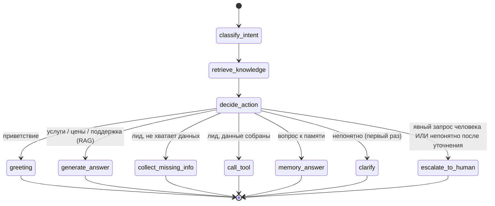

# Поток LangGraph

[English](./langgraph-flow.md) | Русский

Агент — это скомпилированный `StateGraph` (см. `app/agent/graph.py`). Состояние —
`TypedDict` (`app/agent/state.py`), которое передаётся через каждый узел.

## Узлы

| Узел | Что делает |
|------|------------|
| `classify_intent` | Интент по правилам (мок) или LLM + уверенность; извлекает поля лида в память |
| `retrieve_knowledge` | Для интентов по базе знаний достаёт top-k чанков из векторного хранилища |
| `decide_action` | Задаёт ключ маршрутизации по интенту и состоянию лида/уточнений |
| `greeting` | Короткий дружелюбный приветственный ответ (без тикета и без лида) |
| `generate_answer` | Формирует обоснованный ответ из найденного контекста (RAG) |
| `collect_missing_info` | Задаёт один короткий вопрос по недостающим полям лида |
| `call_tool` | Создаёт лид в CRM из собранных полей и очищает их |
| `memory_answer` | Отвечает на вопрос-напоминание из сохранённых полей сессии |
| `clarify` | Задаёт один уточняющий вопрос на непонятное сообщение |
| `escalate_to_human` | Создаёт тикет высокого приоритета и сообщает пользователю |

## Поддерживаемые интенты

`greeting`, `service_question`, `pricing_question`, `lead_qualification`,
`create_lead`, `support_request`, `human_escalation`, `memory_question`,
`unknown`.

## Правила принятия решений

- **Приветствие** → дружелюбный онбординг-ответ. Без тикета и без лида.
- **Вопросы об услугах / ценах / поддержке** → ответ через RAG (`generate_answer`).
- **Интерес / хочет начать (lead_qualification)** → собрать `name` + `contact`
  (и желательно компанию, услугу, бюджет); как только есть — создать лид.
- **Даны полные данные лида (create_lead)** → `call_tool` создаёт лид в CRM.
- **Вопрос-напоминание (memory_question)** → ответ из сохранённых данных сессии.
- **Явный запрос человека, жалоба/гнев или кастомный enterprise-процесс
  (human_escalation)** → создать тикет эскалации.
- **Непонятное сообщение (unknown)** → задать один уточняющий вопрос. Эскалация
  происходит только если следующее сообщение *снова* непонятно.

Важно: низкая уверенность сама по себе никогда не создаёт тикет — приветствия и
обычные сообщения «я новый клиент» обрабатываются как квалификация лида, а не
эскалация.
