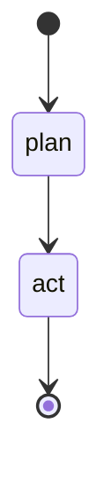

# Поток LangGraph

[English](./langgraph-flow.md) | Русский

Агент — это скомпилированный `StateGraph` (см. `app/agent/graph.py`) всего из двух
узлов: **`plan`** и **`act`**. Состояние — это `TypedDict` (`app/agent/state.py`),
которое проходит через оба узла. Вся логика рассуждений находится в **LLM-планировщике**
(`app/agent/planner.py`); граф лишь оркестрирует, а бэкенд валидирует действия.

## Узел `plan`

1. Формирует **вход** планировщика из профиля компании, найденных через RAG
   знаний, недавней истории диалога, памяти сессии, текущего черновика лида,
   состояния тикета и списка доступных действий, плюс последнее сообщение
   пользователя.
2. Вызывает планировщик, который возвращает одно структурированное **JSON-решение**
   (интент, режим ассистента, извлечённые поля, обновления памяти, недостающие
   поля, одно рекомендованное действие, естественный ответ, признак использования
   знаний + источники и оценку уверенности). Вывод валидируется через Pydantic;
   невалидный JSON чинится одной повторной попыткой, а по-прежнему некорректный
   результат становится контролируемой внутренней ошибкой, а не падением.

## Узел `act`

Планировщик только *рекомендует* действие — выполнять ли его, решает бэкенд
(`app/agent/validation.py`):

- **`create_lead`** выполняется только при прохождении правил лида (см. ниже);
  иначе ассистент естественно спрашивает недостающее.
- **`create_ticket`** выполняется только при обоснованной эскалации; иначе
  ассистент уточняет.
- **`answer_only` / `ask_clarifying_question` / `update_lead_draft` /
  `pause_qualification` / `retrieve_knowledge`** передают ответ планировщика (или,
  в режиме реального LLM, свежесгенерированный контекстный ответ).

Обновления памяти и черновик лида применяются, побочные эффекты (id лида/тикета)
фиксируются, а **финальный ответ пользователю генерирует LLM** — в обычном чате
никаких скриптовых шаблонов.

## Доступные действия

`answer_only`, `update_lead_draft`, `create_lead`, `create_ticket`,
`ask_clarifying_question`, `pause_qualification`, `retrieve_knowledge`.

## Правила создания лида

Лид создаётся, только если выполнено **всё**: для сессии ещё нет лида; присутствуют
имя, компания, валидный email и интерес к услуге; и указан бюджет **или** бюджет
явно неизвестен, а пользователь согласился продолжить без него — и планировщик
действительно рекомендовал `create_lead`. До этого ассистент продолжает
квалификацию. Дублирующие лиды для одной сессии блокируются.

## Правила эскалации (тикет)

Тикет создаётся, только если эскалация действительно обоснована: явный запрос
человека/менеджера/оператора/специалиста/поддержки, реальная жалоба/раздражение,
кастомная/корпоративная потребность или высоконадёжная эскалация планировщика с
содержательной причиной, с которой согласны правила бэкенда. Простое приветствие,
«я новый клиент», «что вы имеете в виду?», «я не помню», «я же вам говорил», шутки,
обычная растерянность или брань без реального запроса поддержки **никогда** не
открывают тикет.

## Офлайн-режим

При `MOCK_LLM=true` детерминированный движок выдаёт тот же контракт решения без
обращений к API, поэтому весь граф работает и тестируется офлайн. Он же служит
безопасным запасным вариантом, если вызов реальной модели не удался.
Детерминированный движок — это офлайн-заглушка, а не слой рассуждений продукта:
с реальной моделью решения принимает LLM-планировщик и пишет каждый ответ.
