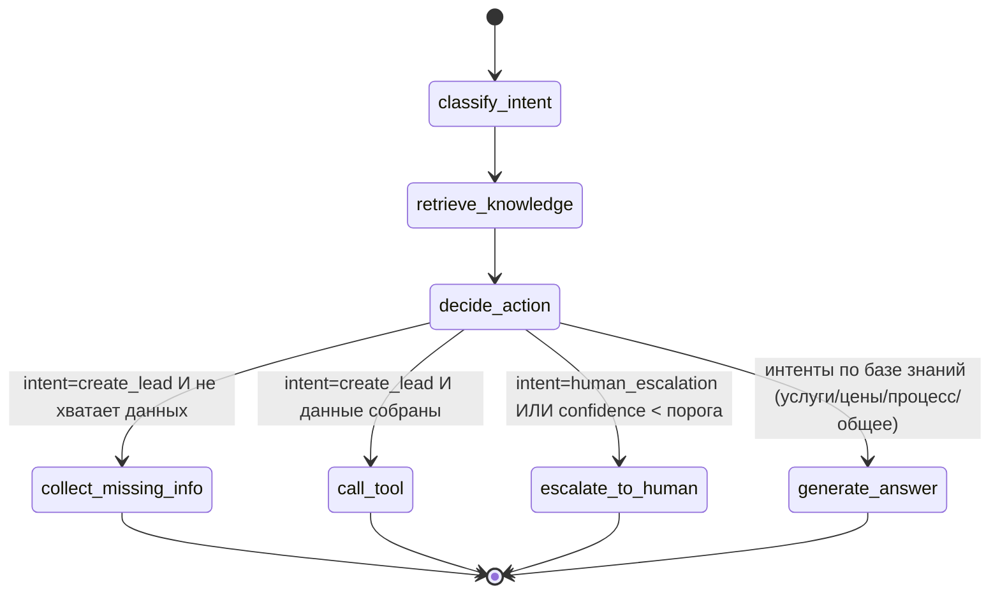

# Поток LangGraph

[🇺🇸English](./langgraph-flow.md) | 🇷🇺Русский

Агент — это скомпилированный `StateGraph` (см. `app/agent/graph.py`). Состояние —
`TypedDict` (`app/agent/state.py`), которое передаётся через каждый узел.

## Узлы

| Узел | Что делает |
|------|------------|
| `classify_intent` | Интент по правилам (мок) или через LLM + уверенность; извлекает поля лида в память |
| `retrieve_knowledge` | Для интентов по базе знаний достаёт top-k чанков из векторного хранилища |
| `decide_action` | Задаёт ключ маршрутизации по интенту, уверенности и недостающим полям |
| `collect_missing_info` | Задаёт один короткий уточняющий вопрос по недостающим полям лида |
| `call_tool` | Создаёт лид в CRM из собранных полей и очищает их |
| `escalate_to_human` | Создаёт тикет высокого приоритета и сообщает пользователю |
| `generate_answer` | Формирует обоснованный ответ из найденного контекста (RAG) |

## Поддерживаемые интенты

`general_question`, `pricing_question`, `service_question`, `create_lead`,
`campaign_status_question`, `support_request`, `human_escalation`, `unknown`.

## Правила принятия решений

- **Вопросы об услугах / ценах / процессах** → ответ через RAG (`generate_answer`).
- **Хочет стать клиентом** → собрать `name` + `contact` (и желательно компанию,
  услугу, бюджет), затем `create_lead`.
- **Просит человека или низкая уверенность** → `escalate_to_human` (тикет).
- **Не хватает данных** → `collect_missing_info` задаёт один краткий вопрос.

Порог уверенности для эскалации настраивается через
`ESCALATION_CONFIDENCE_THRESHOLD` (по умолчанию `0.45`).
